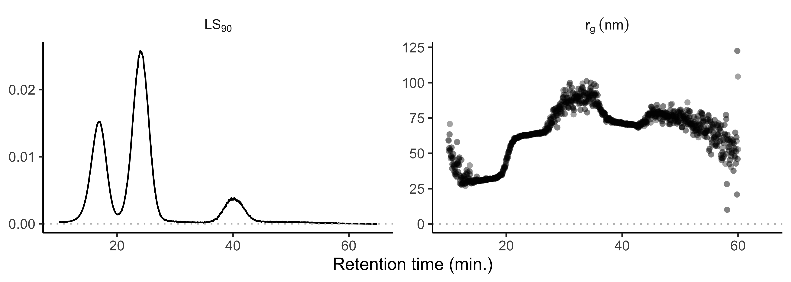
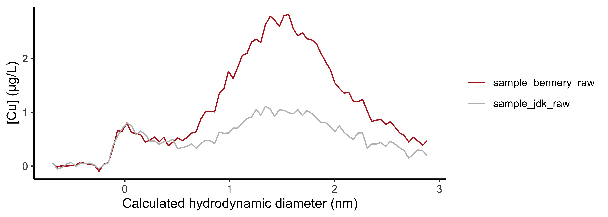
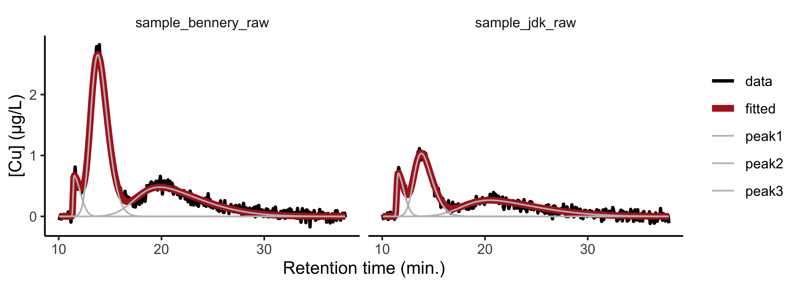
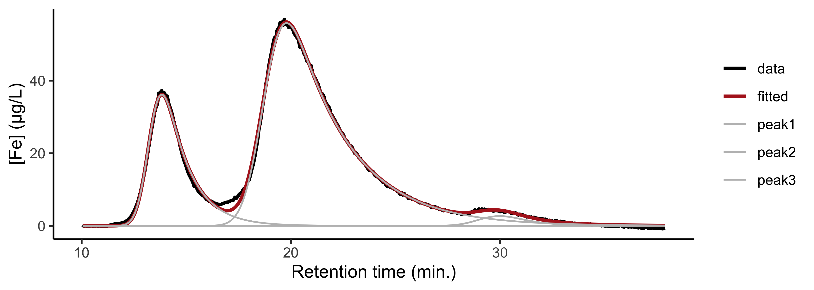

<!-- README.md is generated from README.Rmd. Please edit that file -->

# fffprocessr

<!-- badges: start -->
<!-- badges: end -->

`fffprocessr` is a package for processing field-flow fractionation data.
At the Centre for Water Resources Studies (Dalhousie University, CAN)
where this package was developed, data are generated using a PostNova
AF4 Multiflow 2000 system with UV/Vis, MALS, and ICP-MS detection (see
Trueman et al. (2019) for details). The goal of `fffprocessr` is to
provide users who are new to R with a convenient platform for cleaning
large field-flow fractionation datasets so that they can get to
visualization and analysis more quickly.

## Installation

You can install the development version from
[GitHub](https://github.com/) with:

    # install.packages("remotes")
    remotes::install_github("bentrueman/fffprocessr")

## A basic example

### Loading and cleaning the data

You will need the `tidyverse` package for this example, which can be
installed using `install.packages("tidyverse")`.

    library("fffprocessr")
    library("tidyverse")

`fffprocessr` includes external data which we use here to demonstrate
the loading functions. The external data folder should contain ICP-MS
data files in .csv format, UV-MALS data files in .txt format, and ICP-MS
calibration files in .xlsx format. The data loading functions assume the
following naming convention: ISO 8601 date (YYYY-MM-DD), underscore,
filename (e.g., 2021-01-23\_pockwock.csv). Sample names that include the
word “blank” will be treated as blanks. Determine the path to the
external data as follows:

    system.file("extdata", package = "fffprocessr")

ICP-MS data files are loaded using the `load_icp()` function. If ICP-MS
calibration files are available, use `calibrate = TRUE`.

    icp_data <- system.file("extdata", package = "fffprocessr") %>% 
      load_icp(calibrate = TRUE) 
    icp_data

UV-MALS data files (e.g., UV detector output and 1–2 MALS detector
outputs) are loaded using the `load_uv()` function. Only named detector
outputs are retained in the output; a sensible naming convention is
detector followed by wavelength or angle, as in UV254 or LS90. Don’t
name columns “X” followed by a number, or they won’t show up in the
output.

    uv_data <- system.file("extdata", package = "fffprocessr") %>% 
      load_uv(UV254_1, UV254_2, LS90) # name channels in order from left to right
    uv_data

Combine the two cleaned data files using `combine_fff()`. Blank
subtraction is optional, and it relies on linear interpolation when the
time steps differ between the run and the blank. If there are multiple
blanks on any analysis day their mean is subtracted from the samples.

The function also returns a detection limit for each analysis day and
parameter (the `three_sigma` column). This is calculated as three times
the standard deviation of the elution step of blanks collected on that
date; the user-specified focus step is excluded from this calculation.

After combining the UV-MALS and ICP-MS data, use `correct_baseline()` to
perform a linear baseline correction, choosing left and right endpoints
to yield fractograms with zero baselines.

    data <- combine_fff(
      icp_data, 
      uv_data,
      subtract_blank = TRUE,
      focus = 10
    ) %>% 
      correct_baseline(left = 10, right = 35)

### Plot the data

Now the data are ready to plot (n.b., `ggplot` code has been simplified
slightly for this document, and so the plots it generates will not
appear exactly as they do here).

    data %>% 
      filter(time > 5, time < 37.5) %>% 
      ggplot(aes(time, conc, col = sample)) + 
      facet_wrap(vars(param), scales = "free_y", ncol = 2) + 
      geom_hline(yintercept = 0, col = "grey", linetype = 3) +
      geom_line()


### Fractogram integration

Integrate the entire fractogram for comparison with an external
measurement using the function `integrate_peak()`. You’ll have to supply
the injection volume (L) and the flowrate (L/min) to get a concentration
in the expected units.

    data %>% 
      filter(
        time > 10, # exclude the focus period
        param %in% c("55Mn", "56Fe") # select parameters of interest
      ) %>% 
      group_by(sample, param) %>% 
      summarize(conc_ppb = integrate_peak(time, conc))

To compare integrated peak areas with directly-quantified concentrations
(no FFF), use `load_direct_quant()`, which reads and cleans ICP-MS data
files generated using the iCAP-RQ.

## Estimating the radius of gyration

To estimate the radius of gyration, *r<sub>g</sub>*, you’ll need to load
FFF-MALS files at all scattering angles using `load_mals()`. These files
should be stored in a separate folder, named as follows: ISO 8601 date
(YYYY-MM-DD), underscore, filename, underscore, ls*x*-*y*, where *x* and
*y* are the range of three consecutive scattering angles (e.g.,
2021-01-23\_pockwock\_ls7-20.txt for angles 7, 12, and 20). Here we are
loading a dataset representing a mixture of latex beads with nominal
sizes of 60, 125, and 350 nm.

    mals <- system.file("extdata/mals", package = "fffprocessr") %>% 
      load_mals() %>% 
      correct_baseline(4, 65)

Plot the data:

    mals %>% 
      ggplot(aes(time, conc)) + 
      facet_wrap(vars(param), scales = "free_y") + 
      geom_hline(yintercept = 0, col = "grey", linetype = 3) +
      geom_line()


Calculate *r<sub>g</sub>* using `calculate_rg()`, removing data
collected at the smallest scattering angle (7°). This function solves
the following equation for *r<sub>g</sub><sup>2</sup>*, the mean squared
radius of gyration:

<!-- $$\frac{Kc}{R(\theta)} = \frac{1}{M} + \frac{\langle{r^2_g}\rangle}{3M}\left[\frac{4\pi}{\lambda}sin(\frac{\theta}{2})\right]^2$$ -->


where *K* is a constant, *c* and *M* are the concentration and molar
mass of the analyte, respectively, *lambda* is the wavelength of the
incident light, *theta* is the scattering angle, and *R* is the Rayleigh
ratio (the scattering intensity above the baseline). For environmental
colloids, *K*, *c*, and *M* are usually unknown. But
*r<sub>g</sub><sup>2</sup>* can be estimated by a linear regression of
*1/R* on *sin<sup>2</sup>(theta/2)*. That is,

<!-- $$\langle{r^2_g}\rangle = \frac{3\beta_1\lambda^2}{16\beta_0\pi^2}$$-->


where *beta<sub>0</sub>* and *beta<sub>1</sub>* are the intercept and
slope of the linear regression. This is the Zimm model; see Kammer et
al. (2005) (and references therein) for details (the PostNova AF2000
software manual will also be helpful).

    mals_rg <- mals %>% 
      filter(
        time > 10, 
        param != "ls7"
      ) %>% 
      calculate_rg(window = .05, method = "zimm")

Plot the estimated *r<sub>g</sub>* and the 90° light scattering signal:

    mals_rg %>% 
      filter(param == "ls90") %>% 
      pivot_longer(c(rg_zimm, conc)) %>% 
      ggplot(aes(time, value)) + 
      facet_wrap(vars(name), scales = "free_y") +
      geom_point() +
      geom_hline(yintercept = 0, col = "grey", linetype = 3)



Extract the *r<sub>g</sub>* estimates for each peak, and convert to a
geometric radius (these values match those generated by the PostNova
software). Our estimates based on the Zimm model are not quite right,
and so while the Zimm model is recommended for environmental particles
in this size range (Kammer et al., 2005), other models would likely
perform better for this sample.

    mals_rg %>% 
      filter(timeslice %in% c(17.1, 24.1, 40)) %>% 
      distinct(timeslice, rg_zimm) %>% 
      mutate(d_geom = 2 * rg_zimm / sqrt(3/5))

Here are the Zimm plots at time slices representing each peak. The
linearity assumption breaks down completely for the largest particles
(350 nm diameter, `timeslice == 40`).

    mals_rg %>% 
      filter(timeslice %in% c(17.1, 24.1, 40)) %>% 
      mutate(
        x = sin(pi * theta / 360) ^ 2,
        y = 1 / rayleigh_ratio
      ) %>% 
      ggplot(aes(x, y)) + 
      facet_wrap(vars(timeslice), scales = "free_y") + 
      geom_smooth(method = "lm") +
      geom_point()


For the 350 nm particles, the approach outlined in Watt (2018) yields a
very good estimate of the true particle size.


    mals %>% 
      filter(
        time > 39, 
        param != "ls7"
      ) %>% 
      calculate_rg(window = .05, method = "watt") %>% 
      filter(timeslice == 40) %>% 
      distinct(rg_watt) %>% 
      mutate(d_geom = 2 * rg_watt / sqrt(3/5))

## Estimating the hydrodynamic radius

Provided that the cross-flow is constant, use `calculate_rh()` to
calculate the hydrodynamic radius. The only input without a default is
retention time; the run parameters (cross flow, tip flow, detector flow,
focus period, transition time), channel thickness, temperature, and the
dynamic viscosity of the carrier solution can all be changed, but for
now, the channel dimensions are hard-coded. The function `peak_maxima()`
may also be useful for determining peak retention times.

    data %>% 
      filter(param == "65Cu", time > 10.5, time < 16) %>% 
      mutate(dh = 2 * 1e9 * calculate_rh(time)) %>% 
      ggplot(aes(dh, conc, col = sample)) + 
      geom_line()



## Extras

### Molecular weight calibration

Load a molecular weight calibration data file and fit a curve using
`calibrate_mw()`. The independent variable is retention time and the
dependent variable is the base-10 logarithm of molecular weight. The
options for curve type are “linear” and “quadratic”.

    # load a calibration curve:
    mw_data <- system.file("extdata/mw_calibration", package = "fffprocessr") %>% 
      list.files(full.names = TRUE) %>% 
      read_csv()

    mw_data %>% 
      with(calibrate_mw(peak_retention_time, mw_kda, type = "quadratic", predict = FALSE))
    #> 
    #> Call:
    #> stats::lm(formula = log10(mw) ~ time + I(time^2))
    #> 
    #> Coefficients:
    #> (Intercept)         time    I(time^2)  
    #>     7.20192     -1.23814      0.05242

Predict molecular weight using the `predict = TRUE` argument. Or do an
“inverse” prediction of time (generally for plotting purposes). The
options for output are “time” and “mw”.

    mw_data %>% 
      with(
        calibrate_mw(
          peak_retention_time, 
          mw_kda, 
          type = "quadratic", # or "linear"
          newdata = c(1, 10, 100, 1000), # molecular weights (or time if output = "mw")
          output = "time", # or "mw"
          predict = TRUE
        )
      )
    #> [1] 13.25712 16.41176 18.15480 19.51300

### Peak fitting

The function `deconvolve_fff()` will fit component peaks to fractograms
that are incompletely resolved. By default, it approximates fractograms
as the sum of skewed Gaussians, each of which takes the following form:

<!-- $$y = h e^{-\frac{(x-\mu)^2}{2\sigma}} (1 + erf(\gamma\frac{(x-\mu)}{\sqrt{2} \sigma}))$$ -->


where *y* denotes the instantaneous concentration, *x* the retention
volume, *h* the peak height, *mu* the mean, *sigma* the standard
deviation, *gamma* the shape parameter, and *erf* the error function.

Alternatively, fractograms can be fitted as sums of ordinary Gaussians,
or exponentially modified Gaussians of the form

<!-- $$y = \frac{h\sigma}{\tau}\sqrt{\frac{\pi}{2}} exp\left(\frac{1}{2}(\frac{\sigma}{\tau})^2 - \frac{x-\mu}{\tau}\right)erfc\left(\frac{1}{\sqrt{2}}\left(\frac{\sigma}{\tau} - \frac{x-\mu}{\sigma}\right)\right)$$ -->


where *tau* is the shape parameter, *erfc(x) = 1 - erf(x)*, and the
other parameters are as defined above.

Users supply initial guesses for the peak height (`h`), mean (`mu`),
standard deviation (`s`), and shape parameter (`g`)—see the example
below for some reasonable guesses.

    deconvolved <- data %>% 
      filter(param == "65Cu", time > 10) %>% 
      group_by(date, param, sample) %>% 
      nest() %>% 
      ungroup() %>% 
      mutate(
        model = map(
          data, 
          ~ deconvolve_fff(
            .x$time, .x$conc, 
            # these are the initial guesses for the model parameters
            h = c(.8, .6, .2), mu = c(11, 14, 20), s = c(1, 1, 1), g = c(1, 2, 5),
            fn = "skew_gaussian"
          )
        ),
        fitted = map(model, "fitted"),
        peaks = map(model, "peaks")
      )

Plot the data, the model, and the component peaks:

    deconvolved %>% 
      unnest(c(data, fitted, peaks)) %>% 
      pivot_longer(c(conc, fitted, starts_with("peak"))) %>% 
      ggplot(aes(time, value, col = name)) + 
      facet_grid(rows = vars(param), cols = vars(sample)) +
      geom_line()



The exponentially modified Gaussian (`fn = "emg"`) can sometimes do a
better job:

    deconvolved_emg <- data %>% 
        filter(param == "56Fe", time > 10, sample == "sample_bennery_raw") %>% 
        group_by(date, param, sample) %>% 
        nest() %>% 
        ungroup() %>% 
        mutate(
            model = map(
                data, 
                ~ deconvolve_fff(
                    .x$time, .x$conc, 
                    # these are the initial guesses for the model parameters
                    h = c(35, 50, 8), mu = c(14, 20, 28), s = c(1, 1, 1), g = c(1, 1, .5), 
                    fn = "emg"
                )
            ),
            fitted = map(model, "fitted"),
            peaks = map(model, "peaks")
        )



Use `integrate_peak()` to assign a concentration estimate to each peak:

    deconvolved %>% 
      unnest(c(data, starts_with("peak"))) %>% 
      pivot_longer(starts_with("peak"), names_to = "peak") %>% 
      group_by(date, sample, param, peak) %>% 
      summarize(conc_ppb = integrate_peak(time, value, injvol = 0.001, flowrate = 0.001))

## References

Kammer, F. v. d., M. Baborowski, and K. Friese. 2005. “Field-Flow
Fractionation Coupled to Multi-Angle Laser Light Scattering Detectors:
Applicability and Analytical Benefits for the Analysis of Environmental
Colloids.” Analytica Chimica Acta 552 (1-2): 166–74.
<https://doi.org/10.1016/j.aca.2005.07.049>.

Trueman, Benjamin F., Tim Anaviapik-Soucie, Vincent L’Hérault, and
Graham A. Gagnon. 2019. “Characterizing Colloidal Metals in Drinking
Water by Field Flow Fractionation.” Environmental Science: Water
Research & Technology 5 (12): 2202–9.
<https://doi.org/10.1039/C9EW00560A>.

Wyatt, Philip J. 2018. “Measuring Nanoparticles in the Size Range to
2000 nm.” Journal of Nanoparticle Research 20 (12): 322.
<https://doi.org/10.1007/s11051-018-4397-x>.

<!-- You'll still need to render `README.Rmd` regularly, to keep `README.md` up-to-date. `devtools::build_readme()` is handy for this. You could also use GitHub Actions to re-render `README.Rmd` every time you push. An example workflow can be found here: <https://github.com/r-lib/actions/tree/master/examples>. -->
<!-- You can also embed plots, for example: -->
<!-- ```{r pressure, echo = FALSE} -->
<!-- plot(pressure) -->
<!-- ``` -->
<!-- In that case, don't forget to commit and push the resulting figure files, so they display on GitHub and CRAN. -->
